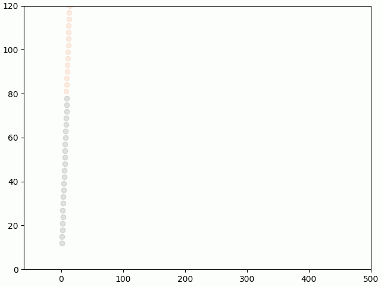
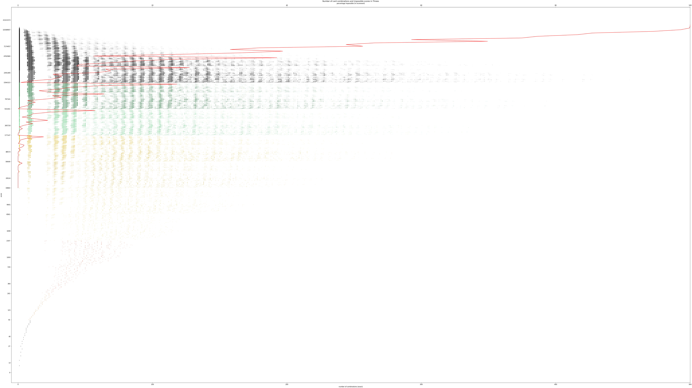

# Threes Analyzer

This is a work in progress. All Three-related research goes there. The first project is to examine which scores are uncommon, and which scores are impossible.

The smallest impossible score is __39,363__. It is also the first number whose sum of ternary digits exceed 16. The list of all impossible scores is listed in impossible_scores.txt.

The `card_combinations.py` module provides the recursive (converted to iterative stack) backtracking method of finding all card combinations. The `impossible_scores.py` goes through all possible scores up to a predetermined range (18,000,000) and saves a .npy file listing the score, the corresponding rank, and the number of combinations for that score. The `impossible_histogram.py` uses the .npy file to display a graph.

## All observations

Plots are color coded by density and by rank, roughly analogous to the Ketchapp colors. Score is in a logarithmic scale. Tick marks are from early rank (high card only) to late rank (high card plus one of each of the lower cards) scores. Rates of impossibility are by the increments used for the line graph. Regions with low number of possible combinations per score have higher rates of impossibility at high rank.

## External links

* [Official site by Asher Vollmer](https://threes.asherv.com/) 
* [Code demonstration 1 (listing all card configurations by score)](https://youtube.com/shorts/W3lzzpMBF6k?feature=shared)
* [Code demonstration 2 (enumerating impossible scores)](https://youtu.be/SVvWMZ1HgOM?feature=shared)
